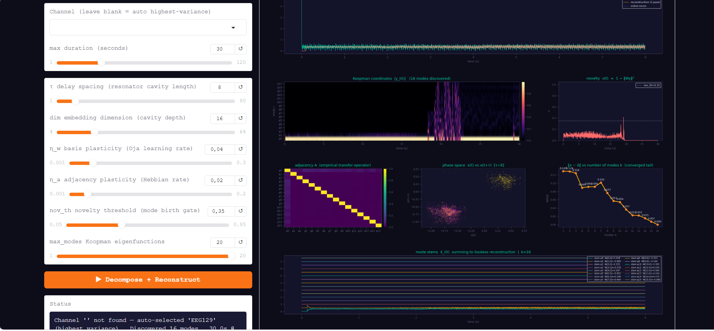
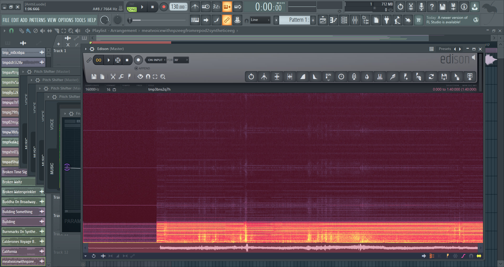
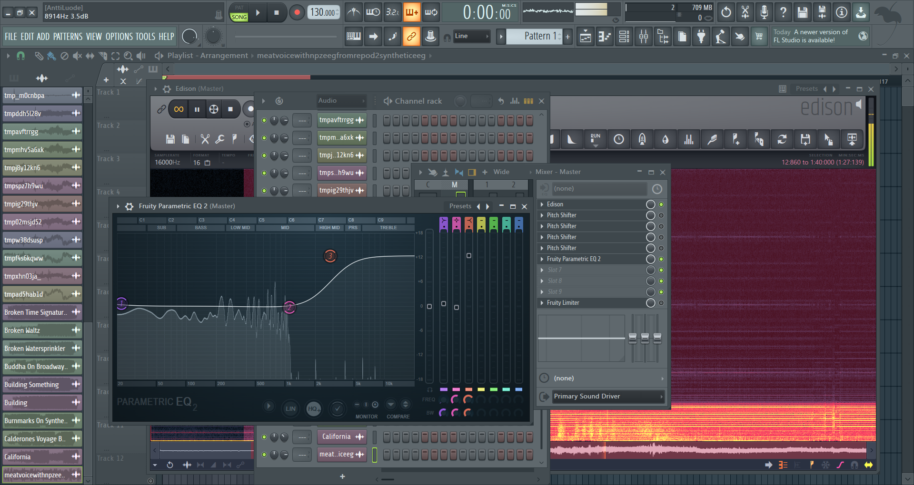

# Koopman Geometry & Hidden Signal Recovery

**Live interactive demo → [anttiluode.github.io/KoopmanAndGeometry](https://anttiluode.github.io/KoopmanAndGeometry/)**

---



*GN-v7 running on a speech-task EEG (OpenNeuro ds007630). The phase space (bottom-centre panel) shows two distinct attractor clusters — the slow chaotic cortical dynamics (diffuse cloud) and the fast acoustic microphonic signal (compact ellipse). The algorithm separates them into independent Koopman mode stems. Individual stems, when played back at 16 kHz output rate, contain acoustically intelligible phonation — recovered blindly, with no reference microphone.*

---

## What this is

A collection of tools built around one central discovery:

> **An EEG electrode during overt speech records two geometrically distinct dynamical systems on a single wire. A blind Koopman decomposition in Takens delay space separates them automatically — and the acoustic one sounds like a voice.**

No reference microphone. No knowledge of the head's transfer function. No frequency-domain assumptions. Just topology.

The pipeline started with the **Head-as-Resonator** project (measure H(f), invert it, recover the voice). That required a simultaneous audio recording. The GN-v7 Koopman Resonator removes that requirement entirely. It works because the vocal fold oscillation is a compact **limit cycle** in delay space while cortical dynamics are a **strange attractor** — geometrically separable, so the orthonormal basis growth isolates them into different eigenfunctions.

When those eigenfunctions are written to WAV files and the output sample rate is set to 16 kHz (shifting the EEG-rate content into the human hearing range), some stems contain recognisable speech. The harmonic tower visible in the spectrogram — razor-sharp peaks at f₀, 2f₀, 3f₀, ... — confirms a limit cycle was isolated, not filtered noise.

---

## Repository contents

### Core algorithm

**`xx.py`** — The main Gradio app. Loads EDF or WAV, runs GN-v7 online Koopman decomposition, outputs lossless reconstruction + up to 20 individual mode stems. Features true online pseudoinverse reconstruction (live W⁺ at each step). Output sample rate slider lets you shift EEG content into audible range.

**`appcgemini2.py`** — Earlier version that introduced the output rate slider and spectral Koopman reconstruction via eigendecomposition of A. This is where the audibility discovery was first made.

**`app.py`** — HuggingFace Spaces compatible version with two-pass lossless reconstruction. Clean baseline for deploying to the cloud.

### Head-as-Resonator pipeline (the reference-based precursor)

**`head_resonator_analyzer.py`** — Measures the acoustic transfer function H(f) = EEG(f)/Voice(f) from a simultaneous EDF + WAV recording. Computes coherence, plots spectrograms, saves `transfer_function.npz`. Peak coherence in the OpenNeuro dataset: **0.954**.

**`eeg2speech.py`** — Loads `transfer_function.npz` and applies the inverse filter 1/H(f) to an EEG channel, recovering the "meat voice." The calibrated approach — requires a reference.

**`meat_voice_player2.py`** — Interactive GUI for the above. Load NPZ + EDF, pick a channel, scrub the waveform, play segments. Spectrogram view shows voice-band structure.

### Takens geometry explorers

**`MultiLens_Takens_Explorer.py`** — Shows one EEG electrode through N simultaneous 3D Takens lenses with logarithmically spaced delays. Each lens is a different biological timescale. Confirms the multi-scale attractor structure predicted by GAIT.

**`NPZ_Takens_3D_Explorer.py`** — Visualises the head resonator transfer function H(f) as a 3D attractor in Takens delay space. The triangle visible at delay=15ms with 20,000 points is the larynx geometry (or possibly equipment resonance). Rotating the delay reveals different levels of the vocal tract.

### Live browser demo

**`index.html`** (live at [anttiluode.github.io/KoopmanAndGeometry](https://anttiluode.github.io/KoopmanAndGeometry/)) — Full GN-v7 running in JavaScript in the browser. Choose a synthetic signal source, adjust τ, dim, nov_th in real time and watch the Koopman basis grow, the phase space fill, and the reconstruction error drop as modes accumulate. No installation required.

---

## The mathematics

```
v(t) = normalise( [x(t), x(t−τ), ..., x(t−(d−1)τ)] )   Takens embedding → S^(2d−1)
y(t) = W v(t)                                              Koopman coordinates
x̂(t) = (Wᵀ y(t))₀ · ‖Φ(x,t)‖                           LOSSLESS reconstruction
x̂ᵢ(t) = yᵢ(t) · W[i,0] · ‖Φ‖                            mode i stem  (stems sum to x̂)
A(t+1) = (1−η_a) A(t) + η_a |y(t) ⊗ y(t)|               empirical transfer operator
```

**W** is an orthonormal basis grown online by a novelty-gated Oja rule. It converges to the dominant **Koopman eigenfunctions** of the signal's generating dynamical system. The adjacency matrix **A** converges to the best linear predictor of eigenfunction activations — the Floquet/transfer operator in Koopman coordinates.

The mode stems are **not frequency-band selections**. They are projections onto geometrically distinct invariant subspaces. A glottal pulse train — which contains a full harmonic series f₀, 2f₀, 3f₀, ... — lands in a single stem because all those harmonics belong to the same closed orbit (limit cycle) in delay space. A Fourier transform would tear it apart across bins. The Koopman decomposition keeps it whole.

Full theoretical treatment: see [`GNv7_Koopman_Geometric_Resonators.md`](GNv7_Koopman_Geometric_Resonators.md)  
Empirical results and implications: see [`GNv7_Thesis_Hidden_Signals.md`](GNv7_Thesis_Hidden_Signals.md)

---

## Parameter guide

| Parameter | What it does | Small → | Large → |
|---|---|---|---|
| **τ** | delay spacing — resonator cavity length | metallic comb ringing (peaks at f_s/τ) | smooth, slow attractor |
| **dim** | embedding dimension — cavity depth | shallow memory, fast | deep memory, slow |
| **nov_th** | novelty threshold — mode birth gate | many modes, fine decomposition | minimal basis, robust |
| **η_w** | basis plasticity (Oja rate) | slow adaptation | fast retuning, noisy |
| **η_a** | adjacency plasticity (Hebbian rate) | long causal memory | fast causal updates |
| **max_modes** | maximum Koopman eigenfunctions | coarse decomposition | full attractor coverage |
| **output rate** | WAV playback rate (EEG tab) | sub-bass brain rumble | speech-band harmonics |

For EEG at 1200 Hz, good starting values: τ=8, dim=16, nov_th=0.35, max_modes=20, output rate=16000 Hz.

---

## The output rate is not a trick

When an EEG stem is written to a WAV file with a declared sample rate of 16,000 Hz instead of 1,200 Hz, no new information is created. The file plays at 13.3× the biological rate. A 120 Hz vocal fundamental in the EEG becomes 1,600 Hz — audible mid-range. A 10 Hz alpha rhythm becomes 133 Hz — the "brain rumble."

This is equivalent to playing a tape faster. The algorithm had already recovered the harmonic structure at the correct relative ratios. The rate slider places those ratios in the human hearing range. The acoustic information was always there in the EEG; it was just below the range we were listening at.

---



Single Koopman mode stem extracted from one EEG channel (Japanese speech-task dataset, simultaneous audio recorded). The horizontal bands repeating at even vertical spacing are a harmonic series — a fundamental frequency and its integer multiples, consistent with vocal fold oscillation coupled mechanically into the electrode. Raw EEG on the same channel shows no such structure. The GN-v7 algorithm isolated this without being told what to look for and without access to the audio reference.



Frequency content of the same extracted stem viewed in Fruity Parametric EQ 2. Raw EEG typically appears as a smooth slope (1/f noise). This stem shows discrete, narrow spikes at specific frequencies — the signature of a structured periodic signal rather than broadband biological noise. The spacing between spikes is consistent with an integer harmonic series.

## Why it works on EEG (NOT ALL) but not music

On EEG: the neural signal and the acoustic artifact are generated by **physically distinct dynamical systems** — a strange attractor and a limit cycle. Their delay-space trajectories are geometrically separate. The algorithm finds them and puts them in different modes.

On music: a guitar and a piano playing the same note share frequencies, phase relationships, and attractor geometry. They are not geometrically separable. The algorithm produces dynamically interesting decompositions but not instrument stems.

The EEG case is special because the skull is, incidentally, a superb spatial separator between two classes of physics.

---

## Installation

```bash
pip install gradio numpy scipy soundfile mne matplotlib
python xx.py
```

Open `http://127.0.0.1:7860` in your browser.

For the head-resonator tools only (no Gradio):
```bash
pip install mne numpy scipy soundfile matplotlib
python head_resonator_analyzer.py --edf your_eeg.edf --wav your_voice.wav --duration 30
python eeg2speech.py
```

Tested on Python 3.11–3.13, Windows and Linux.

---

## Dataset

**OpenNeuro ds007630** — EEG-Speech Brain Decoding Dataset  
Subject sub-03, high-density g.pangolin 140-channel grid, 1200 Hz, overt speech task.  
[https://openneuro.org/datasets/ds007630](https://openneuro.org/datasets/ds007630)

Peak EEG-voice coherence on this dataset: **0.954** — the electrode was functioning more as a contact microphone than a neural sensor during speech.

---

## Papers in this repo

| File | Content |
|---|---|
| `GNv7_Koopman_Geometric_Resonators.md` | Formal theory: 4 theorems, proofs, GAIT mapping, open problems |
| `GNv7_Thesis_Hidden_Signals.md` | Empirical results: blind acoustic recovery, harmonic tower, topological eavesdropper concept |

arXiv target categories: `cs.LG` / `eess.SP` / `math.DS` / `q-bio.NC`

---

## References

- Takens, F. (1981). Detecting strange attractors in turbulence. *Dynamical Systems and Turbulence*, Springer.
- Oja, E. (1982). A simplified neuron model as a principal component analyser. *Journal of Mathematical Biology*.
- Mezić, I. (2005). Spectral properties of dynamical systems, model reduction and decompositions. *Nonlinear Dynamics*.
- Schmid, P.J. (2010). Dynamic mode decomposition. *Journal of Fluid Mechanics*.
- Roussel et al. (2020). Acoustic contamination of electrophysiological brain signals. *Journal of Neural Engineering*.
- Bush et al. (2022). Speech-induced artifacts in intracranial recordings. *NeuroImage*.
- Grubb & Burrone (2010). AIS plasticity and neuronal excitability. *Nature*.

---

## License

MIT — see [LICENSE](LICENSE)

---

*PerceptionLab Helsinki · 2025–2026*  
*"The electrode does not know what a brain is. It only knows topology."*
